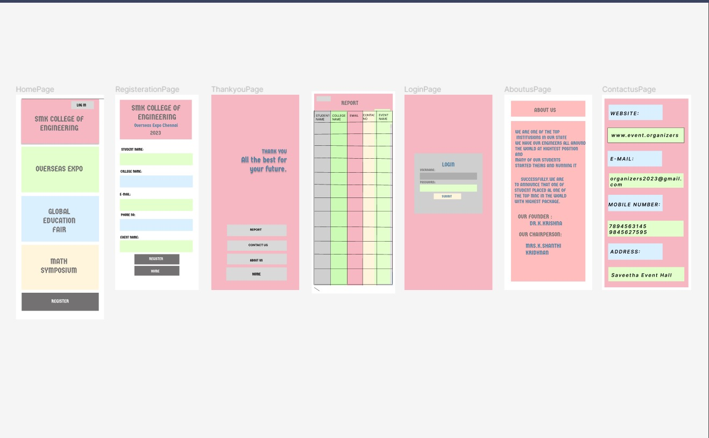

# Event Registration Web Application

## AIM:
To design, develop and deploy a web application for event registration.

## DESIGN STEPS:

### Step 1:
Form a team to ensure the event registeration process

### Step 2:
Enter all the input information based on the program

### Step 3:
Just use everything based on program

### Step 4:
Complete all the process

### Step 5:

Validate the HTML and CSS code.

### Step 6:

Publish the website in the given URL.

## OUTPUT:

## Result:

A web application for event registration is completed successfully.
